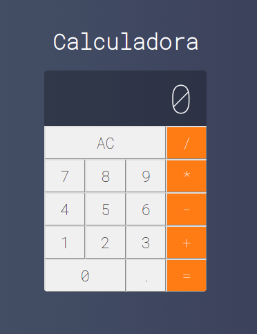

<h1 align="center"> 
  <br /> <br />
    
</h1>

# `Indice`

<a href="#Tecnologias-utilizadas">1. Tecnologia utilizada</a> <br />
<a href="#Como-baixar-o-projeto">2. Como baixar o projeto</a>

---

## Tecnologia utilizada

O projeto foi desenvolvido utilizando as seguintes tecnologia:

- ReactJS

---
## Como baixar o projeto


```bash

  # Clonar o repositório
  $ git clone https://github.com/DevTeles/Calculadora-React.git

  # Entrar no diretório
  $ cd Calculadora-React

  # Instalar as dependências
  $ yarn

  # Iniciar o projeto
  $ yarn start

```
<br />
Desenvolvido por **Rafael Teles Vital**
